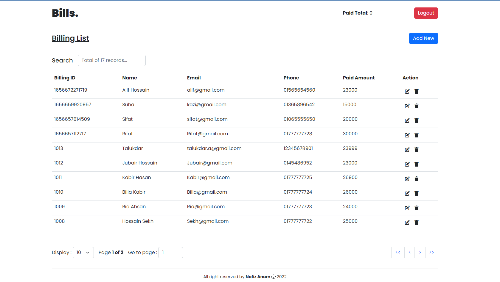
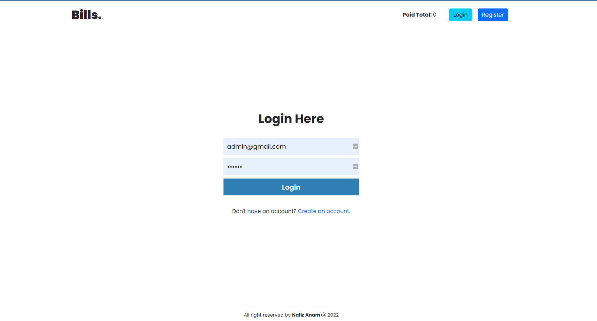
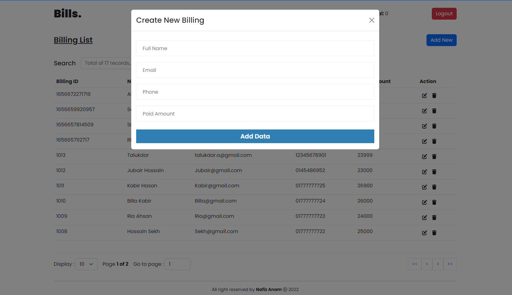
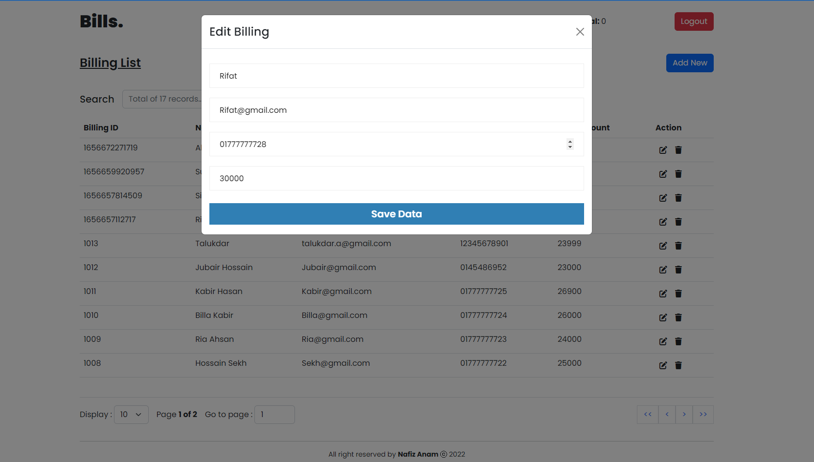

# Bills. (frontend)

**Bills.** is a full feature Online online billings record system.

## Live

[Click](https://ph-instructor-task.netlify.app/) or visit here: https://ph-instructor-task.netlify.app/

## Live API

[Click](https://ph-task-api.herokuapp.com/) or visit here: https://ph-task-api.herokuapp.com/

## Tech Stack

**Client:** Reactjs,React-Router-DOM, Redux-toolkit, Bootstrap, React-Hook-Form, Axios

## Frontend Features

-   Unique Design and Interactive UI
-   Reusable component used for layout and forms
-   Dynamic table
    -   Search table data
    -   sort table data
    -   Table data pagination
    -   Edit/Delete option
    -   Add New billing option
-   Data preload spinner
-   Simple 3 page web app. Login, Registration and Billings
-   Realistic Header,Footer



## API Features

-   Custom JWT Auth
-   All protected routes
-   Used mongodb for storage of data
-   mongoose for server side data validation







## Run Locally

Clone the project

```bash
  git clone https://github.com/Nafiz-Anam/billing-sytem-client
```

Go to the project directory

```bash
  cd billing-sytem-client
```

Install dependencies

```bash
  npm install
```

Start the server

```bash
  npm run start
```

## Authors

-   [Nafiz Anam](https://www.fiverr.com/anam_nafiz)
